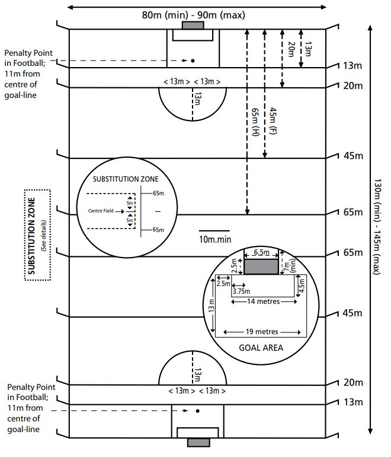

### Pitch Diagram

### Field of Play

<a name="ROS-1.1">1.1</a> The field of play shall be rectangular, and its dimensions shall be as follows:

* Length - 130m minimum and 145 maximum
* Width - 80m minimum and 90m maximum

**Exception:** The dimensions may be reduced by local Bye-Laws for Under 15 or younger grades.

<a name="ROS-1.2">1.2</a> (i) At distances of 13m, 20m, 45m (Football), and 65m (Hurling) from each endline, lines shall be marked across the field parallel to the endline. The intersections of these lines and of the endlines with the sidelines shall be marked by flags.

The midline of the field shall be marked parallel to the endlines, and shall have a minimum length of 10m.

(ii) All lines on the field of play shall be 90mm ± 13mm wide. All lines shall be marked in white with a suitable marking material.

<a name="ROS-1.3">1.3</a> (i) THE SCORING SPACE shall be at the centre of each endline. Each shall be formed by two goalposts, circular in cross section, which shall have a height of not less than 7m above ground level, and be 6.5m apart.

The inside edge of the endline shall be at a tangent to the front edge of the base of the goalposts.

(ii) A CROSSBAR shall be fixed to the goalposts at a uniform height of 2.5m above the ground. The crossbar shall have a rectangular or circular cross section.

When rectangular, it shall have a depth of 140mm ± 10mm and a width not less than 50mm.

When circular, it shall have a uniform diameter of 125mm ± 5mm.

(iii) GOALNETS shall be securely fixed to the back of the crossbar and the back of each goalpost. The roof of the net shall be supported for a horizontal distance of not less than 900mm, at crossbar height, by a metal net support fixed to the back of the goalposts.

The mesh of the net shall have a diagonal length not exceeding 150mm for football and 50mm for hurling.

**Exception** The dimensions of the **Scoring Space** may be reduced by local Bye-Laws for Under 15 or younger grades.

<a name="ROS-1.4">1.4</a> TWO RECTANGLES of the following dimensions shall be formed in front of each scoring space.

a. One rectangle, 14m by 4.5m, shall be formed by two lines 4.5m long and at right angles to the endline being marked 3.75m from the inside of each goalpost, and the ends of these lines being joined.

b. A second rectangle, 19m by 13m, shall be formed by two lines 13m long at right angles to the endline being marked 6.25m from the inside of each goalpost, and the ends of these lines being joined.

c. The endline, including the goal-line, is part of each rectangle, the other three lines enclose the area of that rectangle.

<a name="1.5">1.5</a> A semi-circular arc of 13m radius, centred on the mid-point of the 20m line, shall be marked outside of each 20m line.

<a name="1.6">1.6</a> A point shall be marked 11m from the centre of the goal-line, from which a penalty kick in Football shall be taken

<a name="1.7">1.7</a> SUBSTITUTION ZONE
An area of the sideline, extending 5m. on either side of the centre-line, shall be marked as the Substitution Zone, and all the players coming off/going on to the field of play in acts of substitution/temporary substitution shall go through this point, when given permission by the Referee.

**Exception** An injured player may leave the field at the nearest point to him.

<a name="1.8">1.8</a> FLAGS: All flags used on boundary lines shall have smooth rounded tops.
